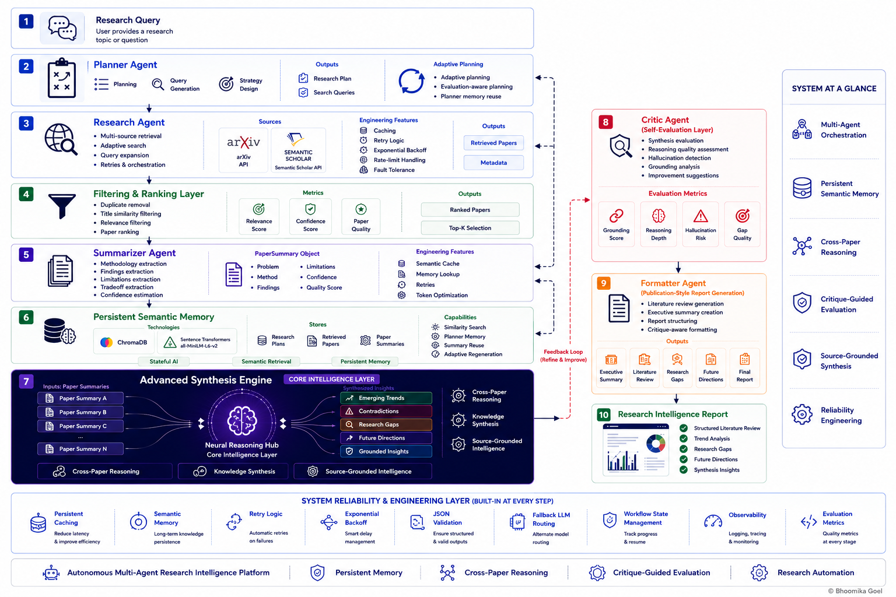

<div align="center">


<br/>


<br/><br/>

[](https://python.org)
[](https://deepmind.google/gemini)
[](https://groq.com)
[](https://www.trychroma.com)
[](https://streamlit.io)

<br/>

[](https://arxiv.org)
[](https://api.semanticscholar.org)
[]()
[](https://langchain-ai.github.io/langgraph)
[]()
[](LICENSE)

<br/>

> *Beyond RAG. Beyond summarization.*
> *Toward grounded, memory-persistent, cross-paper analytical reasoning.*

<br/>

**[→ Full Visual Documentation](https://bhoomikagoel24.github.io/agentic-ai-research-system)**
**[→ Pipeline Execution Evidence](https://bhoomikagoel24.github.io/agentic-ai-research-system/pipeline_showcase.html)**

<br/>

</div>

---

## What this is

Most research tools either retrieve and summarize — or rely on a single LLM prompt to do everything.

**ResearchMind AI** does neither. It decomposes the research task into **specialized coordinated agents**, each with a focused responsibility. It introduces **persistent semantic memory** so the system remembers and reuses previous work across sessions. And it performs **cross-paper reasoning** — not just per-paper summarization — to surface trends, contradictions, gaps, and comparative insights that no single prompt could produce.

The result is a research pipeline that gets meaningfully faster and more efficient with every run.

---

## System Architecture

<p align="center">
  
</p>

<p align="center">
  <a href="assets/architecture_full.png"><b>View Full Architecture →</b></a>
  &nbsp;&nbsp;|&nbsp;&nbsp;
  <a href="https://bhoomikagoel24.github.io/agentic-ai-research-system"><b>Interactive Documentation →</b></a>
</p>

---

## Agent Pipeline

```
┌──────────────────────────────────────────────────────────────────────────────┐
│  01  Planner Agent        Query decomposition · Self-evaluation loop         │
│                           Memory reuse for similar past topics               │
├──────────────────────────────────────────────────────────────────────────────┤
│  02  Research Agent       arXiv + Semantic Scholar · Adaptive expansion      │
│                           Retry logic · Deduplication · Quality filtering    │
├──────────────────────────────────────────────────────────────────────────────┤
│  03  Filter + Rank        Relevance scoring · Recency weighting · Top-K      │
├──────────────────────────────────────────────────────────────────────────────┤
│  04  Summarizer Agent     Structured extraction · Confidence calibration     │
│                           Semantic memory reuse · Summary caching            │
├──────────────────────────────────────────────────────────────────────────────┤
│  05  Synthesis Agent  ★   Cross-paper reasoning · Trend & gap detection      │
│                           Contradiction analysis · Comparative insights      │
├──────────────────────────────────────────────────────────────────────────────┤
│  06  Critic Agent         Hallucination detection · Grounding evaluation     │
│                           Reasoning depth scoring · Critique caching         │
├──────────────────────────────────────────────────────────────────────────────┤
│  07  Formatter Agent      Critique-guided report generation · Academic tone  │
└──────────────────────────────────────────────────────────────────────────────┘
                    ↕  Persistent Semantic Memory  ↕
              ChromaDB · Sentence Transformers · Cosine Similarity
```

---

## Memory Architecture

One of the strongest aspects of ResearchMind AI. Every run that starts from scratch wastes tokens, time, and API quota. The system solves this with a **two-layer optimization strategy**.

### Layer 1 — In-Session Cache

Prevents redundant LLM and API calls within the same pipeline run.

```
Run pipeline → same synthesis requested again → cache hit → no LLM call
```

Covers: query cache · summary cache · critique cache · formatter cache

### Layer 2 — Persistent Semantic Memory

Built on ChromaDB and Sentence Transformers (`all-MiniLM-L6-v2`).
Survives Streamlit restarts, terminal closes, and system reboots.

```
Today    →  generate summary  →  close Streamlit
Tomorrow →  same topic        →  similarity search  →  memory reuse  →  no regeneration
```

Three memory stores run in parallel:

| Store | Purpose |
|---|---|
| **Planner Memory** | Reuse past research plans for similar topics — stabilizes query generation |
| **Paper Memory** | Semantic retrieval of previously fetched papers — reduces external API calls |
| **Summary Memory** | similarity > threshold → reuse · else → regenerate |

---

## Reasoning Capabilities

The **Synthesis Agent** is the core intelligence layer — where ResearchMind AI transitions from information extraction to genuine knowledge synthesis.

```
Isolated summaries     →    Cross-paper reasoning
Per-paper extraction   →    Trend detection across the literature
Independent findings   →    Contradiction and agreement analysis
Basic output           →    Research gap discovery + future directions
```

---

## Sample Output

**Comparative Method Analysis**
> Transformer-based models demonstrate stronger sequential reasoning for temporal forecasting, while GAN-based approaches address data scarcity but introduce distributional shift risks. Neither has been robustly benchmarked across volatile market regimes.

**Synthesized Research Insight**
> Financial AI is shifting toward multimodal, context-aware forecasting systems — but robustness, scalability, and interpretability remain major unresolved challenges. Most benchmarks are single-institution, limiting generalizability claims.

**Research Gaps Identified**
> — No standardized evaluation benchmarks for LLM-based financial reasoning
> — Underexplored multimodal fusion of price signals, text, and macroeconomic context
> — Limited real-time deployment work under volatile market conditions

---

## Reliability Engineering

```
Retry Logic        →  Exponential backoff with jitter on all LLM and API calls
Query Expansion    →  Adaptive broadening when retrieval quality falls below threshold
Fallback Routing   →  Auto-switches to Groq if Gemini fails
State Persistence  →  Shared state dict — any stage reruns independently
JSON Validation    →  Structured output validated at every stage
Deduplication      →  URL-based + title similarity filtering
DEV_MODE           →  Lightweight path for fast, low-cost experimentation
```

---

## Tech Stack

<div align="center">

| Layer | Stack |
|---|---|
| LLM | Gemini 2.5 Flash · Groq (fallback) |
| Memory | ChromaDB · Sentence Transformers (all-MiniLM-L6-v2) |
| Retrieval | Semantic Scholar API · arXiv API |
| Validation | Pydantic · JSON Schema outputs |
| Orchestration | Custom state-based pipeline · LangGraph planned |
| Frontend | Streamlit — Pipeline dashboard + metrics UI |
| Language | Python 3.10+ |

</div>

---

## Known Limitations

The system reasons over **abstracts**, not full papers — limiting deep experimental comparison. Retrieval is **lexical**, not semantic — under-recalls conceptually similar work with different terminology. The Critic Agent evaluates but does not yet **autonomously trigger synthesis re-runs**. Synthesis is currently single-pass with no iterative refinement loop.

These are known constraints — each maps directly to the next development phase.

---

## What's Next

```
→  Recursive synthesis repair — Critic triggers targeted re-synthesis
→  Confidence-threshold driven retrieval loops
→  Full-paper reasoning beyond abstract-only analysis
→  Semantic retrieval replacing lexical scoring
→  LangGraph orchestration with conditional routing
→  MCP-compatible agent architecture
→  Autonomous research refinement loops
```

---

## Design Philosophy

ResearchMind AI was built without heavy orchestration frameworks intentionally — to deeply understand state flow, retry logic, evaluation patterns, and agent interaction **before** abstracting them away.

The biggest realization: building useful AI systems is not about prompting. The hard problems are **memory**, **orchestration**, **reliability**, and **state management** — as critical as model capability itself.

---

<div align="center">

<br/>

**Bhoomika Goel**

*AI/ML Engineering · Agentic Systems · Research Automation*

<br/>


</div>