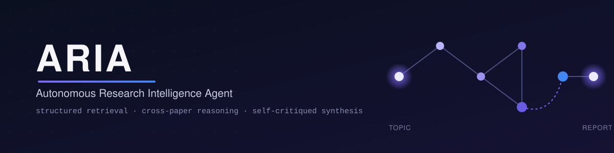
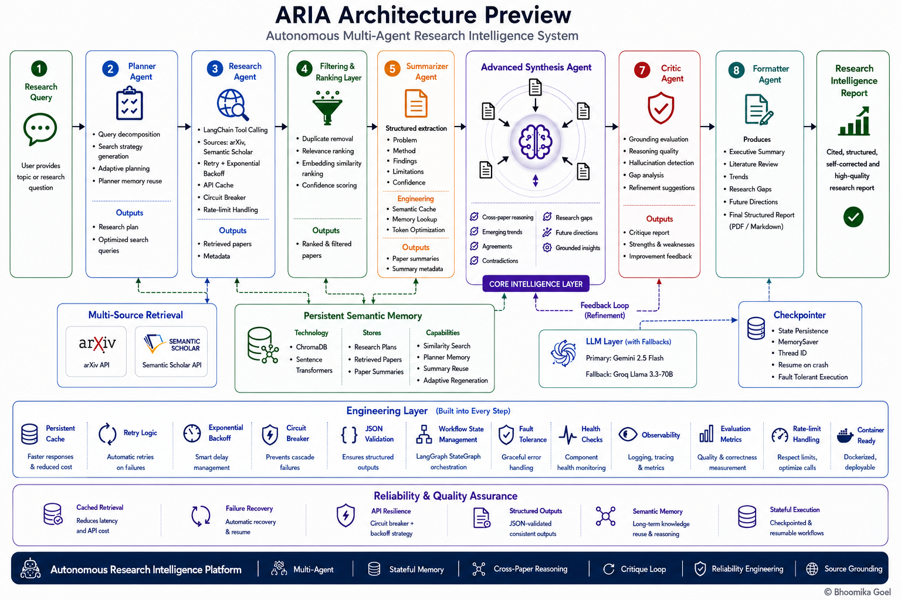
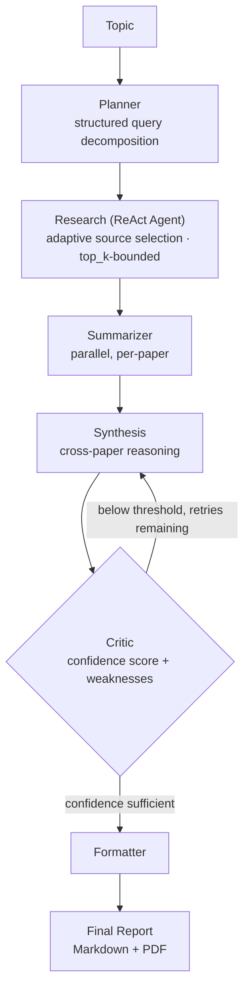

<div align="center">



<br/><br/>

### Autonomous Research Intelligence Agent

A multi-agent pipeline that turns a research topic into a synthesized, self-critiqued literature review — retrieval through final report, end to end.

[](https://python.org)
[](https://langchain-ai.github.io/langgraph)
[](https://langchain.com)
[](https://deepmind.google/gemini)
[](https://groq.com)
[](https://fastapi.tiangolo.com)
[](https://docker.com)
[](LICENSE)

[Architecture](#architecture) · [System at a Glance](#system-at-a-glance) · [Engineering Decisions](#engineering-decisions) · [Quick Start](#quick-start) · [Limitations](#limitations--known-constraints)

<br/>

**Topic → Planner → Research → Summarization → Synthesis → Critique → Report**

</div>

<br/>

## System at a Glance

- LangGraph `StateGraph` orchestration with a conditional critique-and-retry loop
- ReAct-based adaptive retrieval across arXiv, Semantic Scholar, and semantic memory
- Parallel per-paper summarization
- Cross-paper synthesis — trends, contradictions, gaps
- Persistent semantic memory (ChromaDB)
- Automatic three-tier LLM fallback (Gemini 2.5 Flash → Groq 70B → Groq 8B)
- Circuit breaker isolation and proactive rate limiting on retrieval
- Checkpointed execution — crash-safe restarts via `MemorySaver`
- Structured validation at every node and API boundary (Pydantic v2)
- FastAPI backend + Streamlit UI, deployable via Docker Compose
- Benchmark harness for repeatable, topic-based evaluation runs

<br/>

## Overview

Given a topic, ARIA decomposes it into a research plan, retrieves and summarizes relevant papers, reasons across them as a set rather than one at a time, critiques its own draft, and formats the accepted synthesis into a final report — delivered as Markdown and PDF with sources cited.

<br/>

## Architecture

ARIA is implemented as a **LangGraph `StateGraph`** — a fixed set of nodes connected by edges, one of which is conditional. Control flow is declared in the graph definition rather than hardcoded in application logic.

<p align="center">
  
</p>


```mermaid
flowchart TD
    A["Topic"] --> B["Planner<br/>structured query decomposition"]
    B --> C["Research (ReAct Agent)<br/>adaptive source selection · top_k-bounded"]
    C --> D["Summarizer<br/>parallel, per-paper"]
    D --> E["Synthesis<br/>cross-paper reasoning"]
    E --> F{"Critic<br/>confidence score + weaknesses"}
    F -- "below threshold, retries remaining" --> E
    F -- "confidence sufficient" --> G["Formatter"]
    G --> H["Final Report<br/>Markdown + PDF"]
```

### Node Responsibilities

| Node | Responsibility |
|---|---|
| **Planner** | Decomposes the topic into a structured set of search queries via `with_structured_output(ResearchPlan)`. |
| **Research** | ReAct agent selecting between `search_arxiv`, `search_semantic_scholar`, and `search_memory` at runtime; result set bounded by `top_k`. |
| **Summarizer** | Processes retrieved papers concurrently (`ThreadPoolExecutor`); each paper reduced to a structured `PaperSummary`. |
| **Synthesis** | Reasons across all summaries — trends, agreements, contradictions, gaps. |
| **Critic** | Scores synthesis quality, returns structured `CritiqueOutput` (confidence + weakness list). |
| **Formatter** | Converts accepted synthesis into the final report structure. |

The Critic → Synthesis edge is the graph's only conditional edge: below-threshold output re-enters Synthesis with the weakness list attached, up to a bounded retry count; otherwise the graph proceeds to Formatter.

<br/>

## Engineering Decisions

Each major implementation choice is stated as the problem it addresses, the decision made, and the trade-off accepted — not just the technology used.

> **Graph orchestration over a procedural script**
> **Problem** — Each pipeline stage fails differently: retrieval rate-limits, summarization times out on individual papers, synthesis is sometimes judged insufficient.
> **Decision** — Model the pipeline as a `StateGraph` with per-node state, rather than one long function.
> **Trade-off** — More upfront structure (schemas, node boundaries) than a linear script, in exchange for checkpointing, partial retries, and a conditional loop that would otherwise require ad hoc control flow.

> **A critique loop instead of single-pass generation**
> **Problem** — First-pass synthesis over multi-paper input has inconsistent quality; coverage gaps and unsupported claims are the common failure modes.
> **Decision** — Score the draft and route low-confidence output back into Synthesis with specific weaknesses attached.
> **Trade-off** — A retried run takes longer than a single-pass one — bounded by a fixed retry limit rather than left open-ended.

> **A three-tier LLM chain instead of a single provider**
> **Problem** — A single-provider pipeline stalls entirely on a rate limit or outage.
> **Decision** — Chain Gemini 2.5 Flash → Groq Llama 3.3 70B → Groq Llama 3.1 8B via `with_fallbacks`, ordered by capability, not just availability.
> **Trade-off** — Output style and quality can shift when a fallback tier serves a request — continuity is prioritized over strict output consistency.

> **ReAct-based retrieval instead of a fixed source list**
> **Problem** — Always querying every source wastes calls when one is sufficient, and fails outright when one is down.
> **Decision** — Let the Research agent choose which tool to call, and when to stop, based on intermediate results.
> **Trade-off** — Call count and latency per run become less predictable, in exchange for resilience to a single source's outage or rate limit.

<br/>

## System Capabilities

**🧭 Self-critiqued output**
Synthesis is scored before formatting; below-threshold output is revised with specific feedback, not silently accepted.

**🔍 Adaptive, fault-tolerant retrieval**
Source selection happens at runtime; a circuit breaker isolates a failing source without stalling the run.

**🧠 Persistent semantic memory**
Papers and summaries persist in ChromaDB; overlapping topics can be served, in part, from memory instead of re-issuing external calls.

**♻️ Checkpointed execution**
State persists at each node boundary via `MemorySaver`; a restarted run resumes from the last completed node.

**📡 Streaming execution**
The FastAPI service can emit a Server-Sent Event per completed node, for incremental progress rendering — see [Service Interfaces](#service-interfaces).

<br/>

## Reliability & System Engineering

| Mechanism | Failure mode addressed | Implementation |
|---|---|---|
| **Circuit breaker** | Repeated failures against one retrieval source stall the whole run | Opens after a failure threshold on a given source; run continues on the remaining source(s) |
| **LLM fallback chain** | A single-provider outage or quota limit halts the pipeline | `with_fallbacks`: Gemini 2.5 Flash → Groq 70B → Groq 8B, automatic |
| **Rate limiter** | Reactive-only handling means every run eats a 429 before backing off | Paces outbound requests proactively |
| **Checkpoint recovery** | A crashed process loses all progress on a long-running topic | `MemorySaver` persists `ResearchState` at each node boundary; restart resumes from the last completed node |
| **Parallel summarization** | Sequential per-paper summarization scales run time linearly with paper count | `ThreadPoolExecutor` across all retrieved papers |
| **Structured validation** | A malformed LLM response silently propagates downstream | Pydantic v2 schemas at every inter-node and API boundary — `ResearchPlan`, `PaperSummary`, `SynthesisOutput`, `CritiqueOutput` |

<br/>

## Tech Stack

**Orchestration**
LangGraph — `StateGraph`, conditional edges, `MemorySaver` · LangChain — `create_react_agent`, `with_structured_output`, `with_fallbacks`

**Language Models**
Gemini 2.5 Flash (primary) · Groq Llama 3.3 70B → Llama 3.1 8B (fallback chain)

**Retrieval & Memory**
arXiv API · Semantic Scholar Graph API · ChromaDB (separate collections for plans, papers, summaries) · `sentence-transformers/all-MiniLM-L6-v2` embeddings

**Backend & Interface**
FastAPI + Uvicorn (REST and SSE) · Streamlit UI · Pydantic v2 validation throughout

**Infrastructure**
Docker + Docker Compose, separate API and UI services · Python 3.11

<br/>

## Design Principles

- **Explicit orchestration** — control flow lives in the graph definition, not scattered across function calls.
- **Modular agents** — each node has a single responsibility and a defined input/output contract.
- **Reliability first** — every external call, LLM or retrieval, has a defined failure path.
- **Structured communication** — nodes exchange validated schemas, not free-form text.
- **Source-grounded output** — synthesis is scoped to retrieved papers, and the final report cites them.
- **Extensible by construction** — new tools, models, and report sections plug in at defined seams (see [Extending ARIA](#extending-aria)).

<br/>

## Quick Start

**Prerequisites:** Python 3.11, a Gemini API key, a Groq API key (fallback chain), a Semantic Scholar API key (optional — the unauthenticated tier is shared and rate-limits quickly), and Docker if using the containerized path.

```bash
git clone https://github.com/bhoomikagoel24/agentic-ai-research-system.git
cd agentic-ai-research-system
pip install -r requirements.txt
```

**Streamlit UI**
```bash
streamlit run app.py
```

**API server**
```bash
uvicorn api.main:app --host 0.0.0.0 --port 8000
```

**Docker**
```bash
cp .env.example .env   # fill in keys
docker compose up --build
```

<br/>

## Configuration

```bash
# .env
GOOGLE_API_KEY=your_gemini_key
GROQ_API_KEY=your_groq_key
SEMANTIC_SCHOLAR_API_KEY=your_s2_key   # optional but recommended
```

<details>
<summary><b>What each variable affects</b></summary>
<br/>

| Variable | Required | Effect if missing |
|---|---|---|
| `GOOGLE_API_KEY` | Yes | Pipeline cannot run — Gemini is the primary LLM. |
| `GROQ_API_KEY` | Yes, for fallback | A Gemini outage or rate-limit has no fallback path and the run fails. |
| `SEMANTIC_SCHOLAR_API_KEY` | No | Falls back to the shared unauthenticated tier, which rate-limits quickly. |

</details>

**Dev mode** — `"dev_mode": true` via the API or the Streamlit sidebar. Limits to 2 papers and 1 critic retry (~3 minutes instead of 8–15). For iteration, not for evaluating output quality.

<br/>

## Service Interfaces

ARIA can be used through multiple interfaces depending on the deployment scenario.

| Interface | Purpose |
|---|---|
| **Streamlit UI** | Interactive literature review generation |
| **FastAPI** | Programmatic integration via REST and streaming (SSE) |
| **CLI** | Local execution |
| **Docker Compose** | Containerized deployment, API and UI as separate services |

The FastAPI service exposes interactive OpenAPI documentation at `/docs` when running locally — endpoint-level request/response detail lives there rather than in this README.

<br/>

## Limitations & Known Constraints

**Latency is inherent to the design.** A default run is 8–15 minutes — a sequential multi-stage LLM pipeline with a possible critique retry, not a single call. `dev_mode` trades coverage for speed and isn't representative of full-quality output.

**Retrieval scope is fixed to two sources.** Domains with thin coverage on both arXiv and Semantic Scholar (non-CS/physics fields, non-English literature, paywalled work) will return fewer papers than `top_k` requests, regardless of topic breadth.

**Critique checks coherence, not ground truth.** The Critic evaluates the synthesis's internal consistency and coverage against the retrieved papers — it does not independently fact-check claims against source text. A high-confidence report can still contain an LLM-introduced error.

**Fallback changes behavior, not just availability.** A request served by a Groq tier instead of Gemini can differ in style and, at the margin, quality. This is a deliberate continuity/consistency trade-off, not a transparent substitution.

**State is single-process.** `MemorySaver` recovers a crashed process on restart with the same topic. It does not coordinate concurrent runs across multiple processes or machines.

<br/>

## Extending ARIA

**Retrieval**
Add a `@tool`-decorated function alongside `search_arxiv` and `search_semantic_scholar` — the Research node's ReAct agent picks it up without graph changes.

**Reasoning**
Extend `SynthesisOutput` and the Formatter template to add report sections; both are decoupled from retrieval and summarization. Add or reorder LLM fallback tiers in `llm/chat_models.py`.

**Infrastructure**
Adjust critic thresholds and retry limits in `workflows/langgraph_workflow.py` — graph-level configuration, not node-level logic. Swap the memory backend by implementing the same collection interface `memory/` exposes to the Research and Summarizer nodes.

<br/>

## Contributing

Issues and pull requests are welcome. For changes to node behavior or graph structure, include the reasoning behind the change — which failure mode or gap it addresses — alongside the diff. [Engineering Decisions](#engineering-decisions) is the intended reference point for whether a change fits the system's existing trade-offs.

<br/>

<div align="center">

MIT License

</div>

---

<div align="center">

<br/>

**Bhoomika Goel**

*AI/ML Engineering · Agentic Systems · Research Automation*

<br/>


</div>